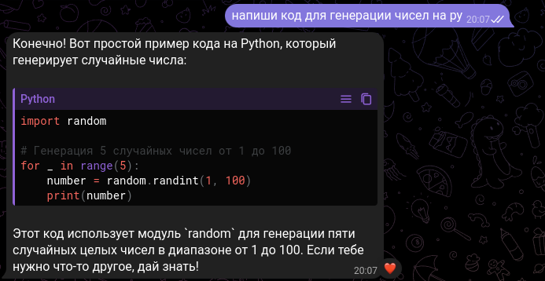

# ChatGPT Telegram Bot



## Описание

Это Telegram бот, использующий модель GPT-4o mini и ряд полезных функций, таких как голосовое распознавание и распознавание текста с изображений. Основная цель бота — предоставить удобный интерфейс для общения с ИИ и получения быстрых ответов на различные запросы.

## Основные функции

- **ChatGPT API**: Взаимодействие с моделью происходит через библиотеку `pip` — `Duckduckgo_search`, которая используется для api Chat GPT.
- **Распознавание голоса (только русский)**: Бот поддерживает преобразование голосовых сообщений на русском языке в текст.
- **Распознавание текста с изображений (только русский)**: Бот способен анализировать изображения и извлекать текст с фотографий на русском языке.

## Установка

1. Клонируйте репозиторий:
    ```bash
    git clone https://github.com/timurkaff/Chat-GPT-for-Telegramm.git
    ```

2. Установите зависимости:
    ```bash
    pip install -r requirements.txt
    ```

3. Настройте переменные окружения:
    - Добавьте ваш Telegram API токен. в файл .env

4. Запустите бота:
    ```bash
    python main.py
    ```
## Проблемы
Если у вас возникнут проблемы с установкой, проверьте на наличие ошибок и обратитесь ко мне, я постараюсь помочь. Можете добавить меня в [Telegram](https://t.me/ssssyyyeee)  для быстрого общения: 

## Используемые библиотеки
- `pytesseract`: Для обработки изображений и распознавания текста.
- `Duckduckgo_search`: Используется для интеграции с API ChatGPT.
- `SpeechRecognition`: Для распознавания голосовых сообщений.

## Благодарности

- Особая благодарность библиотеке `Duckduckgo_search` за простоту и удобство интеграции с API.
